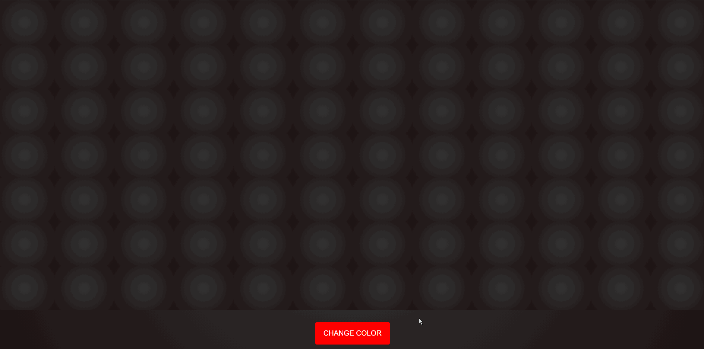

# Random-Colors-Generator

**Random-Colors-Generator:** generates random colors for each box of 84 total boxes (HTML, CSS, JavaScript)

Submitted by: **Rabiul Mazumder**

Time spent: **3** hours spent in total

## Functionality

With the use of grid layout model to align 84 boxes into 12 columns and 7 rows.
Underneath the grid layout is a single red button called "CHANGE COLOR" that when 
the user click it will start the generation of colors. It will also change the text 
of the button to say "STOP" when the user would like to stop the generatio of colors.
When the user hovers over the button it will have an animation to indicate it can be
clicked on. The button expands slightly and had only a red border and transparent backgroud
compared to the uninteractied button where it is entirely red.

## Video Walkthrough

Here's a walkthrough of the Random-Colors-Generator:

GIF created with [LiceCap](http://www.cockos.com/licecap/).
